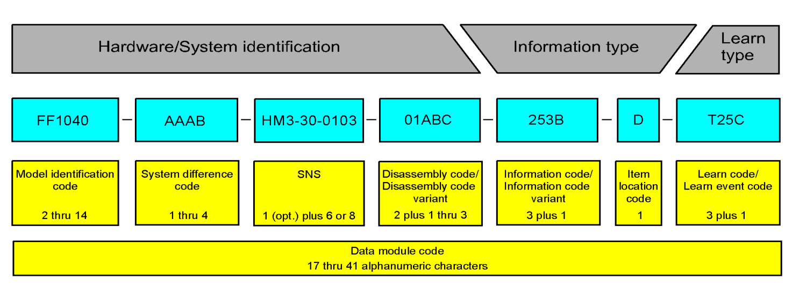

-   [What is S1000D?](#what-is-s1000d)
-   [The CSDB](#the-csdb)
-   [Data modules](#data-modules)
    -   [Data module code](#data-module-code)
        -   [Model identification code](#model-identification-code)
        -   [System difference code](#system-difference-code)
        -   [Standard numbering system](#standard-numbering-system)
        -   [Disassembly code](#disassembly-code)
        -   [Information code](#information-code)
        -   [Item location code](#item-location-code)
    -   [Data module title](#data-module-title)
    -   [Data module content](#data-module-content)

> **Note**
>
> This is a work-in-progress tutorial to introduce the basic concepts of S1000D to new users of the specification or those who have never heard of it before.

What is S1000D?
===============

S1000D is "an international specification for the procurement and production of technical publications". It combines common, international standards and best practices for writing and managing documentation into a single, open specification.

The "S" stands for "specification", and the "D" for "documentation". The "1000" is inspired partly from S1000D's predecessor, ATA100. But while ATA100 was developed specifically for technical publications in the aerospace industry, S1000D takes many of the same ideas and generalizes them for any kind of publication.

S1000D breaks from many of the traditional concepts of publications. These typically divide content in to "chapters", "sections", "subsections", etc. An S1000D publication, on the other hand, is topic-based and consists of units of information called **data modules**, which are stored in a Common Source Database (CSDB).

The CSDB
========

The full title of the S1000D specification is "International specification for technical publications using a common source database". The common source database, or CSDB, is where all the data for your S1000D project is stored, including the data modules. This means a data module is not tied to a particular publication, but can be reused among several publications wherever it is needed, avoiding duplication of data.

The S1000D specification does not give specific requirements for the CSDB, and so CSDBs can be implemented in any number of ways. Often, a CSDB is built on top of an existing relational database management system.

> **Note**
>
> For the purposes of the s1kd-tools, the CSDB is simply be a folder in a typical filesystem.

Data modules
============

The data module is the smallest self-contained unit of information in S1000D. This could be, for example, a description of how a piece of equipment was made, or a procedure to remove it from the system for maintenance.

Data module code
----------------

Each data module is given a unique data module code, which identifies:

-   what part of the system the data module is about

-   what kind of information the data module contains

The first part, which identifies the piece of hardware or part of the system, consists of four major components:

-   Model identification code

-   System difference code

-   Standard numbering system

-   Disassembly code

The second part, which identifies the type of information contained within the data module, consists of two major components:

-   Information code

-   Item location code

An optional third part, the learn type, identifies information about training content. The details of this code are outside the scope of this tutorial, however.

### Model identification code

The model identification code identifies the overall product or project to which a data module belongs. It consists of 2 thru 14 uppercase alphanumeric characters. It is encouraged that S1000D users register their model identification codes with the NATO Support and Procurement Agency, which maintains a list of registered codes, to avoid conflicts with other projects.

<https://www.nspa.nato.int/PDF/Log/S2000M/S2000M%20MOI%20codes.pdf>

An example of a model identification code might be "BIKE" if you are documenting the operation and maintenance of a line of bicycles.

### System difference code

The system difference code identifies major variants of a product. It consists of 1 thru 4 alphanumeric characters.

Continuing with the example above, "A" might represent one model of bicycle and "B" another.

### Standard numbering system

The standard numbering system identifies the detailed breakdown of the product. The idea derives from ATA100, where common components are given a specific chapter, section, subsection, and subject number across all publications. S1000D generalizes these as the system, subsystem, subsubsystem, and assembly codes.

A number of common SNS are provided by the S1000D specification for any project to use, or a project can create its own SNS. For example, data modules related to the pedals on the bicycle might fall under A9-10 of the "General surface vehicles" SNS provided in the specification, where A9 is the system code and means "Controls (drivers)" and 10 is the subsystem and subsubsystem codes and means "Foot controls".

| System | Subsystem | Name               |
|:-------|:----------|:-------------------|
| A9     |           | Controls (drivers) |
|        | -00       | General            |
|        | -10       | Foot controls      |
|        | -20       | Hand controls      |
|        | -30       | Ancillary controls |

### Disassembly code

The disassembly code identifies further breakdown on an assembly to which maintenance information applies. The code consists of 2 typically numeric but optionally alphanumeric characters, plus a 1 thru 3 alphanumeric variant code. The variant code identifies minor variants in components, smaller than the major variants identified by the system difference code.

### Information code

The information code identifies the kind of information contained within a data module. It consists of 3 alphanumeric characters, referred to as the primary, secondary, and tertiary codes. The S1000D specification defines a base set of information codes divided in to 11 primary categories:

-   000 - Function, data for plans and description

-   100 - Operation

-   200 - Servicing

-   300 - Examinations, tests and checks

-   400 - Fault reports and isolation procedures

-   500 - Disconnect, remove and disassembly procedures

-   600 - Repairs and locally make procedures and data

-   700 - Assemble, install and connect procedures

-   800 - Package, handling, storage and transportation

-   900 - Miscellaneous

-   C00 - Computer systems, software and data

The secondary code and tertiary codes break down these categories further in to more specific kinds of information. For example, 040 represents various kinds of descriptions, while 041 specifically deals with descriptions of how a component is made, and 042 specifically deals with the function of a component.

All purely numeric codes are reserved by the specification, but projects can create their own information codes using alphabetic characters for the tertiary code. For example, if a project wants to include a specific kinds of description which does not fall under any of the available 040-049 codes, the project can allocate 04A-04Z. The project must then document the definitions for these information codes in their business rules. Projects may also translate the definitions of existing codes to better fit their project, as long as the original meaning is preserved.

The information code variant is a single alphanumeric character after the information code. This usually identifies alternative ways to perform procedures, with A being the default variant. For example, if 258A means "Other procedure to clean", 258B could mean "Other procedure to clean, Clean with water" and 258C could mean "Other procedure to clean, Clean with air". Both provide a way to clean a component, but in two alternative ways.

### Item location code

The item location code identifies the context of the information contained in a data module, particularly where a task will be carried out. It is one of five codes:

-   A - the information is related to components installed in the system

-   B - the information is related to components installed in a component removed from the system

-   C - the information is related to components on the bench

-   D - the information is related to all three contexts above

-   T - the information is related to training

Data module title
-----------------

The title of an S1000D data module is formed from two parts:

-   The technical name

-   The information name

The tech name is derived from the SNS of the data module, and the info name is derived from the short definition of the information code of the data module. For example, the data module BIKE-A9-10-00-00A-040A-D, which has the SNS A9-10-00 (Foot controls) and information code 040 (Description), would be titled "Foot controls - Description".

Data module content
-------------------

S1000D provides a number of different schemas for different kinds of content within a data module. The schema dictates what elements can be used within that data module's contents. This limits the author of a data module to only using the appropriate elements for a particular context, and helps keep data consistent.

For example, the data module BIKE-A9-10-00-00A-040A-D, which will contain the description of the foot controls of the bicycle, might use the **descriptive** schema. Another data module, BIKE-A9-10-00-00A-520A-D, which is titled "Foot controls - Remove procedure" and enumerates the steps to remove the foot controls from the bicycle, might use the **procedural** schema.

Example of descriptive data module contents:

    <levelledPara>
    <title>General</title>
    <para>A bicycle is a frame and a number of movable components with
    mechanical parts that are completely open. There are no covers or
    sheet metal panels that prevent access to the mechanical parts. Thus,
    you can disassemble the different components of a bicycle to do:
    <randomList>
    <listItem>
    <para>an inspection</para>
    </listItem>
    <listItem>
    <para>a maintenance task</para>
    </listItem>
    <listItem>
    <para>a repair task</para>
    </listItem>
    </randomList>
    </para>
    </levelledPara>

Example of procedural data module contents:

    <proceduralStep>
    <para>Hold the front of the bicycle.</para>
    </proceduralStep>
    <proceduralStep>
    <para>Use the toolset to disengage the fork from the chainring by
    pushing the wheel forwards and down.</para>
    </proceduralStep>
    <proceduralStep>
    <para>Lift the wheel away from the frame.</para>
    </proceduralStep>
    <proceduralStep>
    <para>Put the frame on the floor.</para>
    </proceduralStep>
